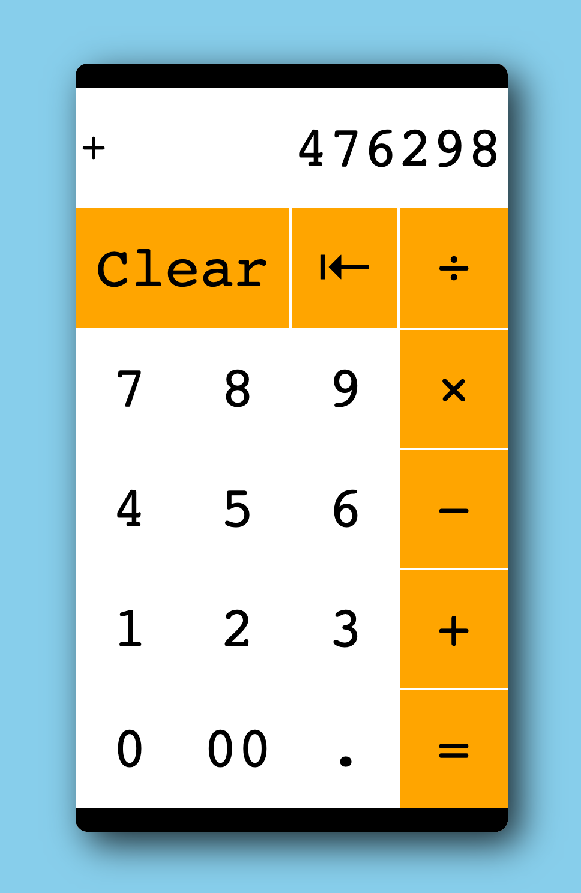

# Project: Calculator

This is a simple calculator made for an Odin Project [assignment](https://www.theodinproject.com/courses/web-development-101/lessons/calculator).
First a text only based calculator was created in JavaScript and then HTML and CSS was added to make a pretty user friend interface.

A switch statement was used to parse calculator input into a float to allow for calculation of long decimals.
A switch statement was used to determine witch operation was clicked.

[View calculator in browser](https://winplam.github.io/calculator/)

## Screenshot

This was a good assignment to get familiar with working with JavaScript functions and storing values.

Also of importance was making a UI look good, uncluttered, and easy to use.
Some tricky parts was handling division by 0, adding a clear and backspace button, and keyboard support.
